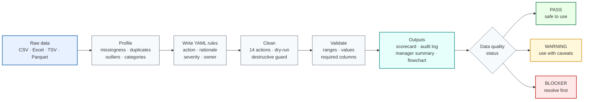

# ByeDataClean

[](https://github.com/kaiyao28/ByeDataClean/actions/workflows/tests.yml)
[](LICENSE)
[](https://www.python.org/downloads/)
[](CHANGELOG.md)
[](docs/roadmap.md)

<!-- Banner: add docs/assets/byedataclean_banner.png and uncomment the line below — see docs/assets/README.md for the design spec. -->
<!-- <p align="center"></p> -->

**From messy data to trustworthy decisions.**

A lightweight data-quality toolkit for analysts and data scientists who need to profile, clean, validate, and document tabular datasets before analysis. Built around explicit YAML rules, before/after validation, and stakeholder-ready audit logs.

Use the Python/R workflow for CSV, Excel, TSV, and Parquet extracts. Use the [SQL cookbook](sql/) when the same checks need to run against warehouse tables.

> **Privacy reminder:** Do not commit raw data or share reports without reviewing them first. See [docs/i_have_a_csv_what_do_i_do.md](docs/i_have_a_csv_what_do_i_do.md#what-is-safe-to-share).

---

## What it does

- **Profile** — surface missingness, duplicates, outliers, type issues, and category inconsistencies
- **Decide** — use structured guides to choose how to handle each finding; document every decision in YAML
- **Clean** — apply rules step-by-step with dry-run preview, destructive-action guardrails, and full audit trail
- **Validate** — run before/after checks on required columns, ranges, accepted values, and unique keys
- **Report** — produce a data-quality scorecard, manager decision memo, Mermaid flowchart, and run manifest
- **Scale** — for warehouse-scale data, use the SQL inspection cookbook that mirrors every Python/R check

---

## How it works



---

## Example business impact

The bundled e-commerce dataset (`data/examples/dirty_orders.csv`, 60 rows) contains realistic issues that affect downstream reporting:

| Issue | Detail | Business metric affected |
|---|---|---|
| Exact duplicate order | ORD-1005 appears twice ($312.75) | GMV overcounted by 2.5% |
| Future-dated order | 2027-03-15 in a 2024 dataset | Appears in current-period revenue |
| Missing customer IDs | 5 orders (8%) | Excluded from retention cohort |
| Missing acquisition channel | 5 orders (8%) | Channel attribution model biased |
| Inconsistent region labels | 5 variants → 3 canonical | Regional revenue double-counted |

**As-reported GMV: $12,614 → After cleaning: $12,301 (−$313, −2.5%)**

```bash
python python/run_cleaner.py \
  --input data/examples/dirty_orders.csv \
  --rules config/example_business_cleaning_rules.yaml \
  --scorecard --decision-memo --dry-run
```

See the [full case study](docs/case_studies/ecommerce_revenue_quality.md) and [example outputs](docs/example_outputs/) — browse the scorecard, decision memo, cleaning log, and flowchart without running any code.

---

## What you get after one run

```bash
python python/run_cleaner.py --input data/raw/orders.csv \
  --rules config/cleaning_rules.yaml \
  --output data/processed/orders_clean.csv \
  --scorecard --decision-memo --flowchart
```

| Output | Location | What it contains |
|---|---|---|
| `orders_clean.csv` | `data/processed/` | Cleaned, analysis-ready dataset |
| `cleaning_log.md` | `reports/cleaning_logs/` | Every action, rationale, rows/cells changed |
| `run_manifest.yaml` | `reports/cleaning_logs/` | Git commit, Python version, row counts |
| `flowchart.mmd` | `reports/cleaning_logs/` | Mermaid diagram of the cleaning run |
| `validation_report.md` | `reports/validation_reports/` | Before/after checks: ranges, accepted values, required columns |
| `scorecard.md` | `reports/scorecards/` | PASS / WARNING / BLOCKER summary with business-impact table |
| `manager_summary.md` | `reports/manager_summaries/` | Decision memo ready to share with stakeholders |

Raw data is never overwritten. Data and reports are git-ignored by default.

---

## Quick start

### 0. One-command demo (no data needed)

```bash
python python/run_demo.py
# or: make demo
```

Runs the full Profile → Dry-run → Clean → Flowchart loop on the bundled dataset.

### 1. Install

```bash
python -m venv .venv && source .venv/bin/activate   # Windows: .venv\Scripts\Activate.ps1
pip install -r requirements.txt
# or: make install
```

See [docs/installation.md](docs/installation.md) for optional packages and R setup.

### 2. Profile your data

```bash
python python/run_reporter.py --input data/examples/example_dirty_data.csv
```

### 3. Dry-run cleaning rules

```bash
python python/run_cleaner.py \
  --input data/examples/example_dirty_data.csv \
  --rules config/example_cleaning_rules.yaml \
  --dry-run
```

### 4. Apply and validate

```bash
python python/run_cleaner.py \
  --input  data/examples/example_dirty_data.csv \
  --rules  config/example_cleaning_rules.yaml \
  --output data/processed/example_cleaned.csv \
  --confirm-destructive --after-report --flowchart --scorecard
```

Copy `config/cleaning_rules.example.yaml` as a starting template for your own data.

---

## Python/R vs SQL

| Workflow | Best for | Key outputs |
|---|---|---|
| **Python/R extract** | CSV, Excel, TSV, Parquet shared with analysts | Cleaned file · scorecard · audit log · manager summary |
| **SQL warehouse** | Product, finance, or event tables too large to export | Profiling queries · duplicate checks · missingness rates · business-impact summaries |

The SQL cookbook mirrors every Python/R step — missingness, duplicates, range checks, date validity, category consistency, and before/after reconciliation — so the same data-quality reasoning applies whether data lives in a local file or a warehouse.

→ [sql/README.md](sql/README.md) · [SQL parity table](sql/README.md#how-sql-checks-map-to-byedataclean-concepts) · [Postgres / BigQuery / Snowflake / DuckDB notes](sql/dialect_notes/)

---

## Safety defaults

- Raw data is **never overwritten** — the cleaner aborts if input and output resolve to the same path.
- **Dry-run** (`--dry-run`) simulates every step and writes a log without touching the data file.
- Row or column drops require `allow_row_drop: true` in the rule **and** `--confirm-destructive` on the CLI.
- Outliers are **flagged**, not removed, unless a rule explicitly says otherwise.
- Every rule carries `decision_status` and `rationale` — recorded verbatim in the audit log.

---

## Documentation

**New to this tool?** Start here:

- [docs/i_have_a_csv_what_do_i_do.md](docs/i_have_a_csv_what_do_i_do.md) — step-by-step from raw file to cleaned output
- [docs/yaml_for_beginners.md](docs/yaml_for_beginners.md) — editing YAML rules safely
- [docs/glossary.md](docs/glossary.md) — plain-language definitions

| Need | Read |
|---|---|
| Usage examples | [docs/usage.md](docs/usage.md) |
| Installation | [docs/installation.md](docs/installation.md) |
| All 14 cleaning actions | [docs/cleaning_rules_reference.md](docs/cleaning_rules_reference.md) |
| Cleaning executor CLI | [docs/cleaning_execution.md](docs/cleaning_execution.md) |
| Before/after validation | [docs/before_after_validation.md](docs/before_after_validation.md) |
| E-commerce case study | [docs/case_studies/ecommerce_revenue_quality.md](docs/case_studies/ecommerce_revenue_quality.md) |
| Example outputs (scorecard, memo, log, flowchart) | [docs/example_outputs/](docs/example_outputs/) |
| Export to dbt / Pandera / Soda | [docs/exporting_quality_checks.md](docs/exporting_quality_checks.md) |
| Compare with Great Expectations / Soda / Pandera | [docs/package_comparison.md](docs/package_comparison.md) |
| SQL cookbook (9 templates + worked example) | [sql/README.md](sql/README.md) |
| Cleaning decision guides | [docs/cleaning_decision_guides/README.md](docs/cleaning_decision_guides/README.md) |
| Troubleshooting | [docs/troubleshooting.md](docs/troubleshooting.md) |
| Roadmap | [docs/roadmap.md](docs/roadmap.md) |
| Changelog | [CHANGELOG.md](CHANGELOG.md) |

---

## Run tests

```bash
make test          # or: python3 -m pytest
make check         # lint + test
make demo-orders   # dry-run e-commerce case study with scorecard + memo + flowchart
```

204 tests covering unit, integration, flowchart, scorecard, business impact, and export checks. See [docs/development.md](docs/development.md).

---

## Contributing

Bug reports, feature requests, and cleaning action suggestions are welcome via [GitHub issue templates](.github/ISSUE_TEMPLATE/). See [docs/development.md](docs/development.md) for contribution guidelines.

---

## License

MIT — see [LICENSE](LICENSE).
