# data-cleaning-toolkit

A lightweight toolkit for running descriptive QC reports on tabular data — built around existing profiling packages, not reinventing them.

---

## Overview

This toolkit gives you four things:

- **Python reporter** — one script that reads a file (or a built-in example dataset) and produces a structured markdown summary of your data.
- **R reporter** — the same idea using R-native tools (skimr, janitor, optionally DataExplorer).
- **SQL inspection cookbook** — numbered SQL query templates you copy, adapt, and run in your own SQL client.
- **Config-driven cleaning executor** — apply a YAML rules file to clean your data reproducibly, with a full before/after audit trail, dry-run mode, and validation.

The design goal is to get you a useful data quality report in under 5 minutes, and reproducible, documented cleaning in under an hour — without writing any custom code.

---

## What it does

**Reporter:**
- Reads CSV, TSV, Excel, or Parquet files.
- Infers variable types (continuous, binary, categorical, date, ID, constant, empty).
- Reports missingness, duplicates, outliers, high-cardinality categories, imbalanced binary variables, future dates, and whitespace/case inconsistencies.
- Optionally validates against a schema file (required columns, allowed values, numeric ranges, unique IDs).
- Optionally generates a full interactive HTML profile using **ydata-profiling** (Python) or **DataExplorer** (R).
- Works with only `pandas`, `numpy`, and `pyyaml` installed — optional packages enhance output but are never required.

**Cleaning executor:**
- Applies a YAML rules file step-by-step in declared order.
- 14 supported actions: rename columns, replace missing codes, trim whitespace, standardise case, map categories, set invalid to missing, flag outliers (IQR), parse dates, remove duplicates, filter rows, create missingness flags, and more.
- Each rule can carry a `decision_status` (`draft` / `approved`) and a `rationale` — both are copied verbatim into the cleaning log for full auditability.
- Dry-run mode: simulates every step and counts changes without writing output.
- Raw data is **never overwritten** — a hard safety check aborts if output resolves to the same path as input.
- Destructive actions (row/column drops) require `--confirm-destructive` on the CLI plus explicit guard keys in the rules file.
- Writes a timestamped cleaning log, machine-readable run manifest (YAML), and validation report after every run.

---

## What it does not do

- It does not automatically clean your data.
- It does not decide what to drop, impute, or recode — that is your decision.
- SQL is not implemented as a full cross-database reporter. SQL dialects differ enough that query templates (which you run yourself) are more useful than a Python wrapper.
- It is not a replacement for production validation tools like dbt tests, Soda Core, Great Expectations, or Pandera. See [`docs/package_comparison.md`](docs/package_comparison.md) for guidance on when to use each.

---

## Repository structure

```
.
├── python/
│   ├── run_reporter.py             ← QC reporter entry point
│   ├── run_cleaner.py              ← cleaning executor entry point
│   └── toolkit/                   ← shared internal package
│       ├── config.py              ← reporter + cleaner config, DEFAULTS, rule loading
│       ├── io.py                  ← read_file / write_file (CSV, TSV, Excel, Parquet)
│       ├── type_detection.py      ← infer_types (continuous, binary, categorical, …)
│       ├── profiling.py           ← dataset stats, warnings, decision prompts
│       ├── report_writer.py       ← build_quick_report / write_quick_report
│       ├── cleaning_actions.py    ← 14 action functions with dry_run support
│       ├── cleaning.py            ← run_cleaning_pipeline orchestrator
│       ├── validation.py          ← schema checks (reporter) + post-clean validation
│       ├── audit.py               ← before/after snapshots
│       ├── log_writer.py          ← cleaning log, validation report, run manifest
│       ├── example_datasets.py    ← penguins / tips / iris loaders
│       └── utils.py               ← safety_check_output, warn, abort, print_banner
├── r/
│   ├── run_reporter.R              ← R reporter entry point
│   └── descriptive_qc/             ← R modules
├── sql/
│   ├── README.md                   ← how to use the cookbook
│   ├── inspection_cookbook/        ← 9 numbered SQL query templates
│   ├── dialect_notes/              ← DuckDB, PostgreSQL, BigQuery, SQLite
│   └── dbt_and_soda_notes.md
├── config/
│   ├── reporter_config.example.yaml   ← reporter config (copy and edit)
│   ├── schema.example.yaml            ← optional schema validation
│   ├── cleaning_rules.example.yaml    ← cleaning rules (copy and edit)
│   ├── category_mapping.example.yaml  ← category label mappings
│   ├── missing_codes.example.yaml     ← sentinel values to convert to NULL
│   └── cleaning_profiles/             ← pre-built rules for common analyses
│       ├── descriptive_analysis.yaml
│       ├── regression_analysis.yaml
│       ├── machine_learning.yaml
│       └── longitudinal_analysis.yaml
├── data/
│   ├── raw/                        ← put your input files here (git-ignored)
│   ├── interim/                    ← intermediate working files (git-ignored)
│   └── processed/                  ← cleaned output files (git-ignored)
├── reports/
│   ├── descriptive_summary/        ← markdown QC reports (git-ignored)
│   ├── full_profiles/              ← HTML profiles (git-ignored)
│   ├── cleaning_logs/              ← timestamped cleaning logs + run manifests (git-ignored)
│   └── validation_reports/         ← timestamped validation reports (git-ignored)
├── docs/
│   ├── cleaning_decision_guides/   ← 9 guides: principles → log
│   ├── templates/                  ← decision log template
│   ├── cleaning_execution.md       ← how to run the cleaner
│   ├── cleaning_rules_reference.md ← all 14 actions with YAML examples
│   └── before_after_validation.md  ← understanding snapshots and validation
├── tests/                          ← pytest unit + integration tests (82 tests)
└── local/                          ← dev-only scripts (git-ignored)
```

---

## Installation

### Python setup

**macOS / Linux:**

```bash
python3 -m venv .venv
source .venv/bin/activate
pip install -r requirements.txt
```

**Windows (PowerShell):**

```powershell
python -m venv .venv
.venv\Scripts\Activate.ps1
pip install -r requirements.txt
```

This installs the core dependencies: `pandas`, `numpy`, `pyyaml`, and `pytest`.

**Optional packages** — install only what you need:

```bash
pip install seaborn          # required for --example-dataset penguins / tips
pip install scikit-learn     # alternative for --example-dataset iris
pip install skimpy           # adds a richer console summary table
pip install ydata-profiling  # required for --mode full or --mode both (HTML report)
```

The reporter will tell you clearly if an optional package is missing. It will not crash — it will continue with the core summary.

### R setup

Install required packages from CRAN:

```r
install.packages(c("readr", "dplyr", "janitor", "skimr", "yaml"))
```

Optional packages:

```r
install.packages("palmerpenguins")  # for --example-dataset penguins
install.packages("DataExplorer")    # for --mode full or --mode both
```

### SQL setup

No installation required. The SQL files in `sql/inspection_cookbook/` are plain text templates. Open them in any text editor or SQL client, replace the `{{ placeholder }}` tokens, and run.

---

## Quick start

### Python: example dataset

The fastest way to see the reporter in action — no data file needed:

```bash
python python/run_reporter.py --example-dataset penguins
```

Other available example datasets:

```bash
python python/run_reporter.py --example-dataset tips
python python/run_reporter.py --example-dataset iris
```

> **Note:** `penguins` and `tips` require `seaborn` (`pip install seaborn`).
> `iris` requires `scikit-learn` or `seaborn`.
> If neither is installed or the download fails, a clear message will tell you what to install.

---

### Python: run on your own data

Place your file in `data/raw/` and run:

```bash
python python/run_reporter.py --input data/raw/my_data.csv
```

To select specific columns and mark ID columns:

```bash
python python/run_reporter.py \
  --input data/raw/my_data.csv \
  --columns age sex bmi diagnosis assessment_date \
  --id-cols participant_id \
  --mode quick
```

**Argument reference:**

| Argument | What it does |
|---|---|
| `--input PATH` | Path to your CSV, TSV, Excel, or Parquet file |
| `--columns COL ...` | Analyse only these columns (default: all) |
| `--id-cols COL ...` | Mark columns as IDs — enables duplicate ID checks |
| `--mode quick\|full\|both` | Report mode (see below) |
| `--config PATH` | Path to a YAML config file |
| `--schema PATH` | Path to a schema YAML for validation checks |
| `--output-dir DIR` | Where to save the markdown report |

---

### Python: config-based run

For reproducible workflows, use a config file instead of long command lines.

Copy the example config and edit it:

```bash
cp config/reporter_config.example.yaml config/reporter_config.yaml
# Edit reporter_config.yaml with your settings
python python/run_reporter.py --config config/reporter_config.yaml
```

Short example of what a config file looks like:

```yaml
input_path: "data/raw/my_data.csv"
output_dir: "reports/descriptive_summary"
columns:
  - age
  - sex
  - bmi
  - diagnosis
id_cols:
  - participant_id
mode: "quick"
```

See [`config/reporter_config.example.yaml`](config/reporter_config.example.yaml) for all available options.

---

### Python: full profile mode

```bash
# Quick markdown summary only (default, no extra packages needed)
python python/run_reporter.py --input data/raw/my_data.csv --mode quick

# Full interactive HTML report (requires: pip install ydata-profiling)
python python/run_reporter.py --input data/raw/my_data.csv --mode full

# Both at once
python python/run_reporter.py --input data/raw/my_data.csv --mode both
```

| Mode | Output | Extra requirement |
|---|---|---|
| `quick` | Markdown summary in `reports/descriptive_summary/` | None |
| `full` | HTML profile in `reports/full_profiles/` | `ydata-profiling` |
| `both` | Both of the above | `ydata-profiling` |

---

### R: example dataset

```bash
Rscript r/run_reporter.R --example-dataset iris
Rscript r/run_reporter.R --example-dataset mtcars
Rscript r/run_reporter.R --example-dataset penguins   # needs: palmerpenguins
```

---

### R: run on your own data

```bash
Rscript r/run_reporter.R --input data/raw/my_data.csv

Rscript r/run_reporter.R \
  --input data/raw/my_data.csv \
  --id-cols participant_id \
  --columns age sex bmi diagnosis
```

The R reporter uses **skimr** for the core summary, **janitor** to clean column names, and optionally **DataExplorer** for a full HTML report (`--mode full`).

---

### SQL inspection cookbook

The SQL cookbook is not run automatically. It is a set of step-by-step query templates you run in your preferred SQL client (DBeaver, DataGrip, `psql`, DuckDB CLI, etc.).

**How to use it:**

1. Open a file from `sql/inspection_cookbook/` — start with `01_row_and_column_counts.sql`.
2. Replace `{{ table_name }}`, `{{ id_column }}`, etc. with your actual names.
3. Run the query.
4. Continue through the numbered files.

**Example — check row count:**

```sql
-- From 01_row_and_column_counts.sql
SELECT COUNT(*) AS n_rows
FROM my_table;       -- replace with your table name
```

**Cookbook files in order:**

| File | Checks |
|---|---|
| `01_row_and_column_counts.sql` | How many rows and columns? |
| `02_missingness_checks.sql` | NULL count and % per column |
| `03_duplicate_checks.sql` | Exact duplicate rows, duplicate IDs |
| `04_continuous_summary.sql` | Mean, SD, min, max, percentiles |
| `05_categorical_summary.sql` | Value counts, top/rare categories |
| `06_binary_summary.sql` | Binary value counts, imbalance |
| `07_date_checks.sql` | Date range, missing, future dates |
| `08_id_integrity_checks.sql` | NULL IDs, duplicate IDs, composite keys |
| `09_range_and_allowed_value_checks.sql` | Out-of-range values, disallowed categories |

See [`sql/README.md`](sql/README.md) and [`docs/sql_workflow.md`](docs/sql_workflow.md).

For production database validation (repeatable, automated), see [`sql/dbt_and_soda_notes.md`](sql/dbt_and_soda_notes.md).

---

## Configuration

The config file controls every aspect of the reporter. Copy the example and edit:

```bash
cp config/reporter_config.example.yaml config/reporter_config.yaml
```

Key settings:

```yaml
input_path: null               # path to your data file (or use --input)
example_dataset: "penguins"    # use a built-in dataset instead

columns: null                  # null = all columns; or list specific columns
id_cols: null                  # list ID column names for duplicate checks

mode: "quick"                  # quick | full | both

thresholds:
  high_missingness: 0.20       # warn if a column has > 20% missing
  very_high_missingness: 0.50  # flag as severe
  imbalance_cutoff: 0.95       # warn if dominant binary class > 95%
  high_cardinality_cutoff: 50  # flag categoricals with > 50 unique values
  rare_category_cutoff: 0.01   # flag categories appearing in < 1% of rows

type_overrides:                # override auto-detection per column
  visit_number: categorical    # treat as categorical even if numeric
```

Full reference: [`config/reporter_config.example.yaml`](config/reporter_config.example.yaml).

---

## Optional schema checks

Pass a schema file to get validation checks on top of the descriptive summary:

```bash
python python/run_reporter.py \
  --input data/raw/my_data.csv \
  --schema config/schema.example.yaml
```

Example schema:

```yaml
# config/schema.example.yaml
columns:
  participant_id:
    role: id
    required: true
    unique: true

  age:
    type: continuous
    min: 18
    max: 100

  diagnosis:
    type: categorical
    allowed_values: ["Control", "SCZ", "BD", "MDD"]
```

Schema checks reported:

- Required columns that are missing
- Columns with disallowed values (with examples)
- Values outside numeric min/max
- Non-unique values in ID columns

Full reference: [`config/schema.example.yaml`](config/schema.example.yaml).

---

## Output files

| Output | Location | Git status |
|---|---|---|
| Quick markdown report | `reports/descriptive_summary/` | **Ignored** |
| Full HTML profile | `reports/full_profiles/` | **Ignored** |
| Raw input data | `data/raw/` | **Ignored** |
| Cleaned output data | `data/processed/` | **Ignored** |

Reports and data are **never committed** — this is enforced by `.gitignore`. Only config examples, code, and `.gitkeep` files are tracked.

---

## Privacy and Git safety

> ⚠️ **Important before sharing reports or pushing to a remote.**

- **Do not commit raw data.** `data/` is fully git-ignored.
- **Do not share reports that may contain sensitive information.** Reports are also git-ignored, but if you copy them elsewhere they may contain column values, category labels, or string examples.
- ID column values are suppressed in report output by default (`privacy.suppress_id_values: true` in config).
- Free-text column examples are suppressed by default.
- Review the generated markdown before sharing it with anyone outside your team.

---

## Troubleshooting

**`ModuleNotFoundError: No module named 'seaborn'`**
→ Install it: `pip install seaborn`. Or use `--input` with your own file instead of `--example-dataset`.

**`ModuleNotFoundError: No module named 'ydata_profiling'`**
→ Install it: `pip install ydata-profiling`. Or use `--mode quick` to skip the HTML report.

**Example dataset fails with a network error**
→ seaborn downloads datasets on first use and caches them in `~/seaborn-data/`. If you have no internet access and no cache, use `--input` with a local file instead.

**`FileNotFoundError: Input file not found`**
→ Check the path. Run from the repo root. Use `data/raw/my_data.csv`, not a relative path from another directory.

**`ValueError: Requested columns not found`**
→ The column names in `--columns` must match the file exactly (case-sensitive). Run without `--columns` first to see all column names in the report.

**Date column not detected as a date**
→ Add the column name to `date_columns` in your config file, or pass it as a type override: `type_overrides: {assessment_date: date}`.

**VS Code: script not found or Python not resolving**
→ Make sure your VS Code Python interpreter is set to the `.venv` interpreter. Open the Command Palette → `Python: Select Interpreter` → choose `.venv/bin/python`.

---

## From QC report to cleaning decisions

The reporter identifies issues. The cleaning decision guides help you decide how to act.

> **The reporter does not automatically clean your data.** Every cleaning decision should be a conscious, documented choice that depends on your analysis purpose.

### After running the reporter

The report now includes a **Cleaning Decision Prompts** section. For each detected issue it shows:

- what was found
- a key question to answer before acting
- a list of possible actions (not prescriptions)
- what to record in your decision log

**Example prompt (from the report):**

```
### Prompt 1 — [Completeness] bmi

Detected: 'bmi' has 24.3% missing values (above 20% threshold).

Question: Why is this variable missing? Is missingness random or related to outcome/exposure?

Options:
- Check missingness by outcome group.
- Use complete-case analysis if missingness is small and plausibly MCAR.
- Consider imputation if missingness is MAR and variable is a key covariate.
- Document assumption about missing mechanism.

Document: % missing; mechanism assumption; handling strategy.
```

### The recommended workflow

```
Step 1  │ Run the QC reporter
        │   python python/run_reporter.py --input data/raw/my_data.csv
        │
Step 2  │ Read the "Cleaning Decision Prompts" section
        │   Open the report in reports/descriptive_summary/
        │
Step 3  │ Open the relevant cleaning guide
        │   docs/cleaning_decision_guides/
        │   e.g. 02_missing_values.md for missingness prompts
        │
Step 4  │ Record your decision in the log
        │   docs/templates/cleaning_decision_log_template.md
        │
Step 5  │ Apply cleaning in a script
        │   Never edit the raw file manually
        │
Step 6  │ Re-run the reporter on the cleaned data
        │   python python/run_reporter.py --input data/processed/my_data_clean.csv
        │
Step 7  │ Compare before vs after
        │   Did the prompts clear? Did row counts change as expected?
```

### Cleaning decision guides

| Guide | Topic |
|---|---|
| [01 — Principles](docs/cleaning_decision_guides/01_cleaning_principles.md) | Core rules before you start |
| [02 — Missing values](docs/cleaning_decision_guides/02_missing_values.md) | Missingness, MCAR/MAR/MNAR, imputation |
| [03 — Duplicates and units](docs/cleaning_decision_guides/03_duplicates_and_units.md) | Rows, IDs, repeated measures |
| [04 — Outliers](docs/cleaning_decision_guides/04_outliers.md) | Error vs real extreme, flagging, options |
| [05 — Categorical variables](docs/cleaning_decision_guides/05_categorical_variables.md) | Labels, mappings, rare categories |
| [06 — Dates and time](docs/cleaning_decision_guides/06_dates_and_time.md) | Parsing, ranges, derived variables |
| [07 — Schema and validation](docs/cleaning_decision_guides/07_schema_and_validation.md) | Expected structure, validation checks |
| [08 — Analysis-specific cleaning](docs/cleaning_decision_guides/08_analysis_specific_cleaning.md) | Decisions that depend on analysis purpose |
| [09 — Cleaning decision log](docs/cleaning_decision_guides/09_cleaning_decision_log.md) | How to record every decision |

### Config templates for cleaning rules

| File | Purpose |
|---|---|
| [`config/cleaning_rules.example.yaml`](config/cleaning_rules.example.yaml) | Per-variable rules (valid range, allowed values, actions) |
| [`config/category_mapping.example.yaml`](config/category_mapping.example.yaml) | Label standardisation mappings (sex, diagnosis, ethnicity, etc.) |
| [`config/missing_codes.example.yaml`](config/missing_codes.example.yaml) | String and numeric codes to convert to NULL before profiling |

### Decision log template

[`docs/templates/cleaning_decision_log_template.md`](docs/templates/cleaning_decision_log_template.md) — copy into your project and fill in as you clean.

---

## Cleaning data after deciding rules

Once you have reviewed the QC report, answered the decision prompts, and
documented your decisions in the cleaning log template, you are ready to apply
cleaning reproducibly using the config-driven executor.

### Step 1 — Copy and edit a cleaning rules file

```bash
cp config/cleaning_rules.example.yaml config/my_cleaning_rules.yaml
```

Or start from a profile tuned for your analysis type:

```bash
# Conservative — flag only, never remove rows
cp config/cleaning_profiles/descriptive_analysis.yaml config/my_rules.yaml

# For regression — no outcome-informed cleaning
cp config/cleaning_profiles/regression_analysis.yaml config/my_rules.yaml
```

A minimal rules file looks like this:

```yaml
version: 1
name: "my_project_cleaning"

metadata:
  analyst: "Your Name"
  analysis_purpose: "cross-sectional descriptive analysis"
  expected_unit: "one row per participant"

safety:
  allow_row_drop: false     # set true + use --confirm-destructive to permit row drops

rules:
  - step: 1
    name: "standardise_column_names"
    action: "standardise_column_names"
    decision_status: "approved"
    rationale: "Consistent names required by downstream scripts."

  - step: 2
    name: "trim_whitespace"
    action: "trim_whitespace"
    columns: string
    decision_status: "approved"
    rationale: "Leading/trailing whitespace causes silent merge mismatches."

  - step: 3
    name: "replace_missing_codes"
    action: "replace_missing_codes"
    columns: all
    missing_codes: ["NA", "Unknown", -9, -99]
    decision_status: "approved"
    rationale: "Confirmed sentinel values with data manager 2024-11-01."

  - step: 4
    name: "clip_age_range"
    action: "set_invalid_to_missing"
    column: age
    min: 18
    max: 100
    decision_status: "approved"
    rationale: "Ages outside [18, 100] are implausible for this adult cohort."

  - step: 5
    name: "harmonise_sex"
    action: "map_categories"
    column: sex
    mapping: {M: Male, male: Male, F: Female, female: Female}
    unmatched_action: warn
    decision_status: "approved"
    rationale: "All unique values reviewed 2024-11-05."

  - step: 6
    name: "add_missingness_flags"
    action: "create_missingness_flags"
    columns: all
    only_if_any_missing: true
    decision_status: "approved"
    rationale: "Required for MNAR sensitivity analysis."

  - step: 7
    name: "remove_duplicate_rows"
    action: "remove_exact_duplicates"
    allow_row_drop: true        # also requires safety.allow_row_drop: true
    decision_status: "approved"
    rationale: "Confirmed double-export with site coordinator 2024-11-08."

validation:
  required_columns: [participant_id, age, sex]
  unique_keys: [[participant_id]]
  accepted_values:
    sex: [Male, Female]
  ranges:
    age:
      min: 18
      max: 100
```

### Step 2 — Dry run first (always)

```bash
python python/run_cleaner.py \
  --input  data/raw/my_data.csv \
  --rules  config/my_cleaning_rules.yaml \
  --dry-run
```

This prints each step with `(DRY RUN)`, counts how many cells/rows would be
changed, writes a cleaning log to `reports/cleaning_logs/`, and runs validation
— all without touching your data.

Review the log, adjust your rules, re-run dry until satisfied.

### Step 3 — Full clean run

```bash
python python/run_cleaner.py \
  --input  data/raw/my_data.csv \
  --rules  config/my_cleaning_rules.yaml \
  --output data/processed/my_data_cleaned.csv \
  --confirm-destructive          # required if any rule drops rows or columns
```

Writes:
- `data/processed/my_data_cleaned.csv` — the cleaned dataset
- `reports/cleaning_logs/…_cleaning_log_YYYYMMDD_HHMMSS.md` — full step-by-step log
- `reports/cleaning_logs/…_manifest_YYYYMMDD_HHMMSS.yaml` — machine-readable run manifest (git commit, row/column counts, timestamps)
- `reports/validation_reports/…_validation_YYYYMMDD_HHMMSS.md` — pass/fail validation checks

### Step 4 — Run the QC reporter on the cleaned data

```bash
python python/run_reporter.py --input data/processed/my_data_cleaned.csv
```

Or do it in one shot:

```bash
python python/run_cleaner.py \
  --input  data/raw/my_data.csv \
  --rules  config/my_cleaning_rules.yaml \
  --output data/processed/my_data_cleaned.csv \
  --after-report
```

### Safety guarantees

| Guarantee | How it works |
|---|---|
| Raw data never overwritten | `safety_check_output()` resolves paths + symlinks; aborts if input == output |
| Destructive actions require double opt-in | `allow_row_drop: true` in the rule **and** `--confirm-destructive` on the CLI |
| Global safety block | `safety: allow_row_drop: false` in rules YAML overrides per-rule guards |
| Dry-run is always safe | No data file written; log still generated for review |
| Every change is audited | Timestamped log, run manifest (YAML with git commit hash), and validation report |
| Decisions are documented in the log | `decision_status` and `rationale` from each rule are recorded verbatim |

### Visual cleaning flow

Add `--flowchart` to generate a Mermaid diagram of the entire cleaning run:

```bash
python python/run_cleaner.py \
  --input  data/raw/my_data.csv \
  --rules  config/my_cleaning_rules.yaml \
  --output data/processed/my_data_cleaned.csv \
  --after-report \
  --flowchart
```

This writes two files alongside the cleaning log:

- `reports/cleaning_logs/…_flow.md` — Markdown file with an embedded Mermaid code block. Open in GitHub, GitLab, Quarto, or MkDocs and the diagram renders automatically.
- `reports/cleaning_logs/…_flow.mmd` — Raw Mermaid text for use with the [Mermaid Live Editor](https://mermaid.live/) or mermaid-cli.

No extra packages are required for Mermaid output — it is plain text. The `## Step Impact Summary` table is always included in the cleaning log (even without `--flowchart`), giving the same information in tabular form.

### Cleaning executor reference docs

| Doc | Contents |
|---|---|
| [`docs/cleaning_execution.md`](docs/cleaning_execution.md) | Full CLI reference, Python API, common issues |
| [`docs/cleaning_rules_reference.md`](docs/cleaning_rules_reference.md) | All 14 actions with YAML examples and risk levels |
| [`docs/before_after_validation.md`](docs/before_after_validation.md) | How to read snapshots and validation reports |

---

## Example cleaning flow

The cleaner generates a visual flowchart from the cleaning audit log. This makes it easy to see — at a glance — what happened between raw input and cleaned output, which steps were destructive, and whether validation passed.

Run command:

```bash
python python/run_cleaner.py \
  --input  data/raw/example.csv \
  --rules  config/cleaning_rules.example.yaml \
  --output data/processed/example_cleaned.csv \
  --after-report \
  --flowchart
```

Generated files:

```
reports/cleaning_logs/example_cleaning_rules_YYYYMMDD_HHMMSS_flow.md
reports/cleaning_logs/example_cleaning_rules_YYYYMMDD_HHMMSS_flow.mmd
```

Example output (rendered on GitHub, GitLab, Quarto, and MkDocs):

```mermaid
flowchart LR
  N0["Raw data<br/>Rows: 100<br/>Columns: 8<br/>Missing cells: 36<br/>Duplicate rows: 4"]
  N1["Step 1: standardise_column_names<br/>Columns renamed: 5"]
  N2["Step 2: replace_missing_codes<br/>Cells changed: 12"]
  N3["Step 3: trim_whitespace<br/>Cells changed: 18"]
  N4["Step 4: map_categories<br/>Cells changed: 9<br/>Warnings: 1"]
  N5["Step 5: flag_bmi_outliers<br/>Outliers flagged: 3<br/>Columns added: 1"]
  N6["Step 6: remove_exact_duplicates<br/>Rows removed: 4<br/>⚠ DESTRUCTIVE"]
  N7["Validation<br/>Passed: 6<br/>All 6 checks passed"]
  N8["Cleaned data<br/>Rows: 96<br/>Columns: 9<br/>Missing cells: 28<br/>Duplicate rows: 0"]

  N0 --> N1 --> N2 --> N3 --> N4 --> N5 --> N6 --> N7 --> N8

  classDef input_node       fill:#e8f1ff,stroke:#2b6cb0,stroke-width:2px;
  classDef clean_step       fill:#f7fafc,stroke:#4a5568,stroke-width:1px;
  classDef destructive_step fill:#ffe8e8,stroke:#c53030,stroke-width:2px;
  classDef warning_step     fill:#fff8db,stroke:#d69e2e,stroke-width:2px;
  classDef validation_node  fill:#e6fffa,stroke:#319795,stroke-width:2px;
  classDef output_node      fill:#e9ffe8,stroke:#2f855a,stroke-width:2px;

  class N0 input_node;
  class N1 clean_step;
  class N2 clean_step;
  class N3 clean_step;
  class N4 warning_step;
  class N5 clean_step;
  class N6 destructive_step;
  class N7 validation_node;
  class N8 output_node;
```



Colour key:

| Colour | Meaning |
|---|---|
| Blue | Raw input data |
| Grey | Standard cleaning step — no warnings, no row or column drops |
| Yellow | Step completed with at least one warning |
| Red | Destructive step — rows or columns were removed |
| Teal | Validation — all rule checks passed |
| Green | Final cleaned output |

> The diagram is a quick visual summary. The full cleaning log contains the detailed audit trail with rationale, decision status, and per-step before/after counts.

---

## Running tests

```bash
python -m pytest
```

Or with verbose output:

```bash
python -m pytest tests/ -v
```

The test suite has **128 tests** across five files:

| File | What it tests | Tests |
|---|---|---|
| `tests/test_cleaner_actions.py` | Each of the 14 cleaning action functions: unit tests with and without dry-run | 26 |
| `tests/test_cleaner_smoke.py` | Cleaning pipeline end-to-end: log sections, dry-run, manifest, safety checks | 22 |
| `tests/test_flowchart.py` | Flowchart module: node labels, Mermaid syntax, CSS classes, file I/O, pipeline integration | 32 |
| `tests/test_full_loop.py` | Full analyst loop: profile → clean → re-profile → validate, flowchart, byte-exact raw file check | 14 |
| `tests/test_reporter_smoke.py` | QC reporter: report output, type inference, and decision prompts | 15 |
| `tests/test_config_validation.py` | Config loading, defaults, and validation errors | 8 |

All tests build DataFrames in-memory or write only to pytest's `tmp_path`. No optional packages are required.

---

## Recommended workflow

```
Step 1 │ Put your raw file in data/raw/
       │
Step 2 │ Run a quick report to get a first look
       │   python python/run_reporter.py --input data/raw/my_data.csv
       │
Step 3 │ Review the report:
       │   - Which columns have high missingness?
       │   - Are there duplicate rows or duplicate IDs?
       │   - Are there outliers or implausible values?
       │   - Are category labels consistent?
       │   - Are there future dates?
       │
Step 4 │ Add a schema file if you have defined expectations
       │   python python/run_reporter.py \
       │     --input data/raw/my_data.csv \
       │     --schema config/schema.example.yaml
       │
Step 5 │ Re-run after making changes to your config or schema
       │
Step 6 │ Apply cleaning decisions in your analysis script
       │
Step 7 │ Save cleaned data to data/processed/
```

---

## Roadmap

**Stage 1 — complete**
- Python quick reporter (markdown summary)
- Python example dataset loader (penguins, tips, iris)
- SQL inspection cookbook (9 files, 4 dialect notes)
- Config and schema files
- pytest smoke tests

**Stage 2 — complete**
- Cleaning decision guides (9 guides + decision log template)
- Cleaning decision prompts section in the QC report
- Config templates: cleaning rules, category mappings, missing codes
- 4 analysis-specific cleaning profiles

**Stage 3 — complete**
- Config-driven Python cleaning executor (`run_cleaner.py`)
- 14 cleaning actions with dry-run support (including `create_missingness_flags`)
- `decision_status` + `rationale` fields in every cleaning rule — logged verbatim
- Machine-readable run manifest YAML (git commit, Python version, row/column counts)
- `--confirm-destructive` CLI guard for row/column drops
- Global `safety:` block in rules YAML
- Before/after dataset snapshots and validation checks
- Timestamped cleaning log (with embedded Mermaid flowchart), run manifest, and validation report
- `--flowchart` flag: generates `.mmd` and `.md` Mermaid flow diagrams (no extra packages required)
- Step Impact Summary table always included in cleaning log
- Unified `python/toolkit/` internal package (replaces separate `descriptive_qc/` + `data_cleaning/`)
- 128 pytest tests (unit + integration + flowchart + full-loop)

**Stage 4 — planned**
- Full HTML profiling mode via ydata-profiling (Python)
- Full HTML profiling mode via DataExplorer (R)
- Complete R cleaning executor (`run_cleaner.R`)
- Pandera schema validation integration
- pointblank examples (R)
- dbt test generation templates
- Soda Core check templates

---

## License

_Placeholder — add your preferred licence before making this repository public._

---

## Acknowledgements

This toolkit wraps and orchestrates work from the following open-source projects:

- [pandas](https://pandas.pydata.org/) and [numpy](https://numpy.org/) — core data handling
- [ydata-profiling](https://github.com/ydataai/ydata-profiling) — optional full HTML profiling
- [skimpy](https://github.com/aeturrell/skimpy) — optional console summary
- [skimr](https://github.com/ropensci/skimr) — R summary statistics
- [janitor](https://sfirke.github.io/janitor/) — R data cleaning helpers
- [DataExplorer](https://boxuancui.github.io/DataExplorer/) — optional R HTML report
- [palmerpenguins](https://allisonhorst.github.io/palmerpenguins/) — R example dataset
- [seaborn](https://seaborn.pydata.org/) — Python example datasets
