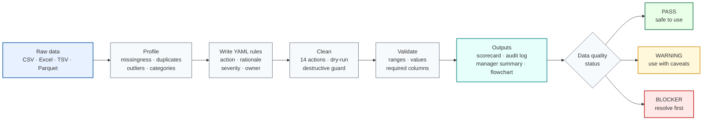

```mermaid
flowchart LR
  N0["Raw data<br/>Rows: 100<br/>Columns: 8<br/>Missing cells: 36<br/>Duplicate rows: 4"]
  N1["Step 1: standardise_column_names<br/>Columns renamed: 5"]
  N2["Step 2: replace_missing_codes<br/>Cells changed: 12"]
  N3["Step 3: trim_whitespace<br/>Cells changed: 18"]
  N4["Step 4: map_categories<br/>Cells changed: 9<br/>Warnings: 1"]
  N5["Step 5: flag_bmi_outliers<br/>Outliers flagged: 3<br/>Columns added: 1"]
  N6["Step 6: remove_exact_duplicates<br/>Rows removed: 4<br/>⚠ DESTRUCTIVE"]
  N7["Validation<br/>Passed: 6<br/>All 6 checks passed"]
  N8["Cleaned data<br/>Rows: 96<br/>Columns: 9<br/>Missing cells: 28<br/>Duplicate rows: 0"]

  N0 --> N1 --> N2 --> N3 --> N4 --> N5 --> N6 --> N7 --> N8

  classDef input_node       fill:#e8f1ff,stroke:#2b6cb0,stroke-width:2px;
  classDef clean_step       fill:#f7fafc,stroke:#4a5568,stroke-width:1px;
  classDef destructive_step fill:#ffe8e8,stroke:#c53030,stroke-width:2px;
  classDef warning_step     fill:#fff8db,stroke:#d69e2e,stroke-width:2px;
  classDef validation_node  fill:#e6fffa,stroke:#319795,stroke-width:2px;
  classDef output_node      fill:#e9ffe8,stroke:#2f855a,stroke-width:2px;

  class N0 input_node;
  class N1 clean_step;
  class N2 clean_step;
  class N3 clean_step;
  class N4 warning_step;
  class N5 clean_step;
  class N6 destructive_step;
  class N7 validation_node;
  class N8 output_node;
```

# ByeDataClean

[](https://github.com/kaiyao28/ByeDataClean/actions/workflows/tests.yml)
[](LICENSE)
[](https://www.python.org/downloads/)
[](CHANGELOG.md)
[](docs/roadmap.md)

<!-- Banner image: add docs/assets/byedataclean_banner.png and uncomment the line below — see docs/assets/README.md for the design specification. -->
<!-- <p align="center"></p> -->

**From messy data to trustworthy decisions.**

A Python toolkit for profiling, cleaning, and documenting tabular data — with reproducible YAML rules, automated validation, and stakeholder-ready summaries. Built for analysts who need to answer: _"Is this data safe to use?"_

> **Privacy reminder:** Do not commit raw data or share reports without reviewing them first. Reports may contain column names, category labels, and summary statistics from your dataset. See [Safety defaults](#safety-defaults) and [docs/i_have_a_csv_what_do_i_do.md](docs/i_have_a_csv_what_do_i_do.md#what-is-safe-to-share).

---

## How it works



---

## What you get after one run

```bash
python python/run_cleaner.py --input data/raw/orders.csv --rules config/cleaning_rules.yaml \
  --output data/processed/orders_clean.csv --scorecard --decision-memo --flowchart
```

| Output file | Location | What it contains |
|---|---|---|
| `orders_clean.csv` | `data/processed/` | Cleaned, analysis-ready dataset |
| `cleaning_log.md` | `reports/cleaning_logs/` | Every action, rationale, rows/cells changed |
| `flowchart.mmd` | `reports/cleaning_logs/` | Visual Mermaid diagram of the cleaning run |
| `run_manifest.yaml` | `reports/cleaning_logs/` | Git commit, Python version, row counts — machine-readable |
| `validation_report.md` | `reports/validation_reports/` | Before/after checks: required columns, ranges, accepted values |
| `scorecard.md` | `reports/scorecards/` | PASS / WARNING / BLOCKER status with business-impact table |
| `manager_summary.md` | `reports/manager_summaries/` | Non-technical decision memo ready to share with stakeholders |

No extra packages required for core cleaning. Raw data is never overwritten.

---

## Before / after — 60-row e-commerce extract

**Raw export (excerpt):**

```
order_id   order_value  region          product_category  order_date
ORD-1005    312.75      APAC            Apparel           2024-01-14
ORD-1005    312.75      APAC            Apparel           2024-01-14  ← exact duplicate
ORD-1017     34.50      us              electronics       2024-02-09  ← inconsistent labels
ORD-1021   -149.99      Europe          Apparel           2024-02-17  ← negative value
ORD-1050    425.00      North America   Electronics       2027-03-15  ← future date
```

**After ByeDataClean:**

```
order_id   order_value  region          product_category  order_date
ORD-1005    312.75      APAC            Apparel           2024-01-14  ✓ kept
            [removed]                                                  ✓ duplicate dropped
ORD-1017     34.50      North America   Electronics       2024-02-09  ✓ labels fixed
ORD-1021      NaN       Europe          Apparel           2024-02-17  ⚠ flagged for review
ORD-1050    425.00      North America   Electronics       2027-03-15  ⚠ date flagged
```

Reported GMV: **$12,614** → Corrected: **$12,301** (−$313, −2.5%)

---

## Data quality scorecard — example output

Generated automatically with `--scorecard`:

| Check | Status | Business impact |
|---|:---:|---|
| Order ID uniqueness | ✗ BLOCKER | Duplicate ORD-1005 — GMV overcounted by $313 (2.5%) |
| Date validity | ✗ BLOCKER | Future-dated order appears in current-period revenue |
| Customer ID completeness | ⚠ WARNING | 8% of orders excluded from retention cohort |
| Acquisition channel | ⚠ WARNING | 8% missing — channel attribution model biased |
| Currency codes | ✓ RESOLVED | Standardised to ISO 4217 (USD / GBP / EUR) |
| Region labels | ✓ RESOLVED | 5 variants consolidated to 3 canonical regions |
| Product categories | ✓ RESOLVED | Typos and casing fixed across 7 rows |

**Overall: ⚠ WARNING** — safe for exploratory analysis. Do not publish GMV or retention figures until the two BLOCKER items are resolved.

---

## Business use cases

- **Prevent duplicate orders from inflating revenue** — detect and remove exact duplicates before aggregating GMV or reporting to finance.
- **Detect missing customer IDs before retention analysis** — flag and quantify orders that cannot be joined to the CRM or included in cohort models.
- **Flag invalid dates before dashboard refresh** — parse failures and future-dated records surfaced with warnings before they distort time-series charts.
- **Document cleaning decisions before sharing analysis** — every rule carries a rationale, decision status, and analyst name, recorded verbatim in the audit log.
- **Generate audit logs for reproducible stakeholder review** — timestamped cleaning logs and run manifests for every pipeline run; reviewable without re-running the code.

---

## Why use this?

- Profile CSV, TSV, Excel, or Parquet files in under 5 minutes — no Python coding required, only CLI commands.
- Identify missingness, duplicates, outliers, invalid ranges, and category inconsistencies.
- Use structured decision guides to choose how to act on each finding.
- Apply explicit YAML cleaning rules that describe every step and your rationale.
- Generate timestamped logs, validation reports, run manifests, and a visual cleaning flowchart.
- Raw data is never overwritten. Every run is auditable.

**How it compares:** ByeDataClean is not a replacement for Great Expectations, Soda Core, or dbt tests. Those tools validate data in production pipelines. ByeDataClean is for the earlier step — profiling a dataset you've just received, deciding how to clean it, and documenting those decisions before analysis begins. See [docs/package_comparison.md](docs/package_comparison.md).

---

## Example business impact

The bundled e-commerce case study (`data/examples/dirty_orders.csv`) contains 60 orders with realistic data-quality problems:

| Issue detected | Detail | Business metric affected |
|---|---|---|
| Exact duplicate order | ORD-1005 appears twice ($312.75) | GMV overcounted by 2.5% |
| Future-dated order | order_date = 2027-03-15 | Appears in current-period revenue |
| Invalid calendar date | order_date = 2023-02-29 (non-leap year) | Order excluded from time series |
| Missing customer ID | 5 orders (8%) | Excluded from retention cohort |
| Missing acquisition channel | 5 orders (8%) | Channel attribution model biased |
| Inconsistent region labels | 5 variants → 3 canonical | Regional revenue double-counted |
| Category typo | "Electroncis" → Electronics | Category revenue understated |

**As-reported GMV: $12,614 → After deduplication: $12,301 (−$313, −2.5%)**

```bash
# Run the orders case study
python python/run_cleaner.py \
  --input data/examples/dirty_orders.csv \
  --rules config/example_business_cleaning_rules.yaml \
  --dry-run
```

See [docs/case_studies/ecommerce_revenue_quality.md](docs/case_studies/ecommerce_revenue_quality.md) for the full analysis and safe-vs-unsafe decision guide.

---

## Example cleaning flow

The cleaner generates a visual flowchart from the audit log after every run:

```bash
python python/run_cleaner.py \
  --input  data/raw/my_data.csv \
  --rules  config/cleaning_rules.example.yaml \
  --output data/processed/my_data_cleaned.csv \
  --after-report \
  --flowchart
```



Blue = raw data · Grey = standard step · Yellow = warning · Red = destructive · Teal = validation · Green = cleaned output.

> The diagram is a quick visual summary. The full cleaning log contains detailed rationale, decision status, and per-step before/after counts.

---

## Quick start

### 0. One-command demo (no data needed)

```bash
python python/run_demo.py
```

Runs the full Profile → Dry-run → Clean → Flowchart loop on the bundled example dataset. No internet required. Prints all output paths when done.

### 1. Install

```bash
python -m venv .venv
source .venv/bin/activate      # Windows: .venv\Scripts\Activate.ps1
pip install -r requirements.txt
```

See [docs/installation.md](docs/installation.md) for optional packages and R setup.

### 2. Profile the example dataset

A small dirty dataset is included — 50 rows with realistic issues:

```bash
python python/run_reporter.py --input data/examples/example_dirty_data.csv
```

The report will flag: 22% missing BMI, duplicate IDs, an age outlier (999), inconsistent sex labels, and a future assessment date.

### 3. Preview cleaning (dry run)

A matching rules file is included — no editing needed to run the demo:

```bash
python python/run_cleaner.py \
  --input data/examples/example_dirty_data.csv \
  --rules config/example_cleaning_rules.yaml \
  --dry-run
```

Simulates every step and writes a log without touching the data. Review the log, adjust rules, repeat.

### 4. Apply cleaning

```bash
python python/run_cleaner.py \
  --input  data/examples/example_dirty_data.csv \
  --rules  config/example_cleaning_rules.yaml \
  --output data/processed/example_cleaned.csv \
  --confirm-destructive \
  --after-report \
  --flowchart
```

`--confirm-destructive` is required because the rules include `remove_exact_duplicates`.

> **Using your own data?** Replace `example_dirty_data.csv` and `example_cleaning_rules.yaml` with your own paths. Copy `config/cleaning_rules.example.yaml` as a starting template.

---

## Outputs

| Output | Location | Flag |
|---|---|---|
| QC report | `reports/descriptive_summary/` | auto |
| Cleaned data | `data/processed/` | `--output` |
| Cleaning log | `reports/cleaning_logs/` | auto |
| Run manifest (YAML) | `reports/cleaning_logs/` | auto |
| Validation report | `reports/validation_reports/` | auto |
| Manager summary | `reports/cleaning_logs/` | auto |
| Flowchart (`.md` + `.mmd`) | `reports/cleaning_logs/` | `--flowchart` |
| Data quality scorecard | `reports/scorecards/` | `--scorecard` |

**Example scorecard output:**

```markdown
# Data Quality Scorecard

**Dataset:** `dirty_orders.csv`   **Generated:** 2024-05-15 14:32

## Overall status: ⚠ WARNING

One or more issues require investigation before this data is used for reporting.

## Issues by severity
| Severity | Steps flagged |
|---|---:|
| Critical | 1 |
| High     | 2 |
| Medium   | 1 |
| Low      | 0 |

## Recommended use
- ✓ Safe for exploratory analysis
- ✗ Safe for dashboard refresh
- ✗ Safe for experiment readout
- ✗ Safe for executive reporting
- ✗ Not safe without investigation
```

Data and reports are never committed — `data/` and `reports/` are git-ignored.

---

## Safety defaults

- Raw data are **never overwritten** — the cleaner aborts if input and output resolve to the same path.
- **Dry-run** simulates every step and writes a log without touching the data file.
- Row or column drops require `allow_row_drop: true` in the rule **and** `--confirm-destructive` on the CLI.
- Outliers are **flagged by default**, not removed.
- Each rule can carry `decision_status` and `rationale` — both are recorded verbatim in the cleaning log.

---

## Python, R, and SQL

**Python** is the primary workflow. All features described here are implemented in Python.

**R** provides a parallel reporter (`r/run_reporter.R`) using skimr and janitor. A full R cleaning executor is planned for Stage 4.

**SQL** provides a copy-edit-run inspection cookbook (`sql/inspection_cookbook/`) — 9 numbered query templates you run in your own SQL client. No automatic report generation; SQL dialects differ too much for a reliable wrapper.

---

## Config files at a glance

| File | Used by | Controls | Do beginners need to edit it? |
|---|---|---|---|
| `config/reporter_config.example.yaml` | `run_reporter.py` | Columns, thresholds, privacy, output dir | Optional — CLI flags cover most needs |
| `config/schema.example.yaml` | `run_reporter.py --schema` | Expected column types, ranges, allowed values | Optional — for stricter input checks |
| `config/cleaning_rules.example.yaml` | `run_cleaner.py` | Every cleaning step, rationale, validation | **Yes** — copy and edit for each project |
| `config/example_cleaning_rules.yaml` | `run_cleaner.py` / `run_demo.py` | Demo rules for the bundled example dataset | No — demo only |
| `config/cleaning_profiles/*.yaml` | `run_cleaner.py` | Pre-built rule sets for common analysis types | Optional — good starting point |
| `config/category_mapping.example.yaml` | Referenced by `map_categories` rules | Reusable label mappings (sex, diagnosis, etc.) | Optional — useful for shared codelists |

---

## Documentation

**New to this tool?** Start here:
- [docs/i_have_a_csv_what_do_i_do.md](docs/i_have_a_csv_what_do_i_do.md) — step-by-step from raw file to cleaned output
- [docs/yaml_for_beginners.md](docs/yaml_for_beginners.md) — editing YAML rules safely
- [docs/glossary.md](docs/glossary.md) — plain-language definitions

| Need | Read |
|---|---|
| Detailed usage examples | [docs/usage.md](docs/usage.md) |
| Installation options | [docs/installation.md](docs/installation.md) |
| Reporter CLI and config | [docs/reporter_reference.md](docs/reporter_reference.md) |
| Cleaning executor CLI | [docs/cleaning_execution.md](docs/cleaning_execution.md) |
| All 14 cleaning actions | [docs/cleaning_rules_reference.md](docs/cleaning_rules_reference.md) |
| Snapshots and validation | [docs/before_after_validation.md](docs/before_after_validation.md) |
| Cleaning decision guides | [docs/cleaning_decision_guides/README.md](docs/cleaning_decision_guides/README.md) |
| E-commerce case study | [docs/case_studies/ecommerce_revenue_quality.md](docs/case_studies/ecommerce_revenue_quality.md) |
| Exporting to dbt / Pandera / Soda | [docs/exporting_quality_checks.md](docs/exporting_quality_checks.md) |
| Comparing with Great Expectations / Soda / Pandera | [docs/package_comparison.md](docs/package_comparison.md) |
| SQL cookbook | [docs/sql_workflow.md](docs/sql_workflow.md) |
| Troubleshooting | [docs/troubleshooting.md](docs/troubleshooting.md) |
| Tests and contributing | [docs/development.md](docs/development.md) |
| Repository structure | [docs/architecture.md](docs/architecture.md) |
| Roadmap | [docs/roadmap.md](docs/roadmap.md) |
| Release checklist | [docs/release_checklist.md](docs/release_checklist.md) |
| Banner and visual assets | [docs/assets/README.md](docs/assets/README.md) |

---

## Run tests

```bash
python -m pytest
```

204 tests. See [docs/development.md](docs/development.md) for the full breakdown.

---

## Contributing

Bug reports, feature requests, and cleaning action suggestions are welcome. Please use the [GitHub issue templates](.github/ISSUE_TEMPLATE/) to describe what you need. See [docs/development.md](docs/development.md) for the test setup and contribution guidelines.

---

## Changelog

See [CHANGELOG.md](CHANGELOG.md) for a full version history.

**Current version:** 0.2.0 — Auditable cleaning and validation
**Next planned:** 0.3.0 — See [docs/roadmap.md](docs/roadmap.md)

---

## License

This project is licensed under the MIT License. See [LICENSE](LICENSE) for details.
