# Cleaning flowchart — dirty_orders

Generated by `--flowchart` on 2026-06-15T09:14:22.

```mermaid
flowchart LR
  N0["dirty_orders.csv\nRows: 60 | Cols: 11\nMissing cells: 34\nDuplicate rows: 1"]
  N1["1 · trim_whitespace\nRows Δ: 0 | Cells: 12"]
  N2["2 · standardise_case (currency_code)\nRows Δ: 0 | Cells: 3"]
  N3["3 · standardise_categories (region)\nRows Δ: 0 | Cells: 5"]
  N4["4 · standardise_categories (product_category)\nRows Δ: 0 | Cells: 7"]
  N5["5 · map_values (refunded)\nRows Δ: 0 | Cells: 3"]
  N6["6 · parse_dates (order_date)\nRows Δ: 0 | Cells: 2\n⚠ 2 dates coerced to NaT"]
  N7["7 · flag_values_outside_range (order_value)\nRows Δ: 0 | Flag cols: 1"]
  N8["8 · create_missingness_flags\nRows Δ: 0 | Flag cols: 2"]
  N9["9 · remove_exact_duplicates\nRows Δ: −1 | ⚠ destructive"]
  N10["orders_clean.csv\nRows: 59 | Cols: 13\nMissing cells: 32"]

  N0 --> N1 --> N2 --> N3 --> N4 --> N5 --> N6 --> N7 --> N8 --> N9 --> N10

  classDef input_node    fill:#e8f1ff,stroke:#2b6cb0,stroke-width:2px
  classDef clean_step    fill:#f7fafc,stroke:#4a5568,stroke-width:1px
  classDef warning_step  fill:#fff8db,stroke:#d69e2e,stroke-width:2px
  classDef destructive_step fill:#ffe8e8,stroke:#c53030,stroke-width:2px
  classDef output_node   fill:#e9ffe8,stroke:#2f855a,stroke-width:2px

  class N0 input_node
  class N1,N2,N3,N4,N5,N7,N8 clean_step
  class N6 warning_step
  class N9 destructive_step
  class N10 output_node
```

**Legend**

| Colour | Meaning |
|---|---|
| Blue border | Input / output file |
| Grey | Standard cleaning step |
| Amber | Step that coerced or flagged values |
| Red | Destructive step (rows or columns dropped) |
| Green | Output file |

_Generated by ByeDataClean v0.3.0 · `--flowchart` flag_
